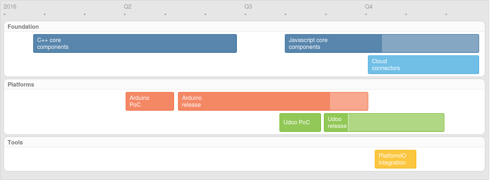

# RxFusion

A Reactive programming framework for IoT from edge to cloud.

## Project goals

* Lightweight reactive C++ extensions for embedded devices
* Consistent reactive extensions across C++ and Javascript
* Multi-node and polyglotinous programming (i.e. connecting edge, gateway, and data center devices)
* Public repository and management tools for reactive components:
  * Sensor data acquisition components
  * Data transformation and aggregation library
  * Upstream connectors to IoT cloud platforms

## Roadmap



## Javascript Preview

Perfect for gateways, cloud or SoC edge devices, the rxfusion module
for Node.js makes it easy to consume upstream data, transform it,
aggregate it and send it on to downstream services, databases, or web
clients.

```javascript
http.listen(8090, function(){
    var mcu = new Mcu();
    var browser = new SocketIO(io, 'hist');

    // Average 5 samples at a time and send a sliding window of data to socket.io clients
    rx()(mcu >> AverageOf(5) >> Window(16,true) >> browser);
});
```

This example uses RxFusion embedded in a Node.js web server and sends
data to web clients via a socket.io connector.  The sensor data is
coming from a locally connected MCU.  The data is processed with the
same operators available for C++, but without the types!

The `AverageOf` operator outputs an average every 5 samples to reduce
the volume of data, and the `Window` operator sliding window of the
last 16 values.  The browser client uses the [C3](http://c3js.org/)
library to display the sliding window of data real-time in a graph:

```
var chart = c3.generate({
  data: { columns: [], type: 'spline' }
});

var socket = io();
socket.on('hist', function(data) {
  chart.load({ columns: [ Array.concat('ambient', data) ] });
  socket.emit('ack', 'ok');
});
```

## Documentation

[Operators](docs/operators-contents.md) [Index](docs/operators-index.md)

## Building

At this point, this project contains only RxFusion foundation which is
the common device-independent layer.  However, you can build desktop
applications for simulation and experimentation.  Have a look at the
unit testes for examples.

### Run unit tests

Clone RxFusion framework:

```bash
$ git clone https://github.com/sathibault/RxFusion.git
$ cd RxFusion/
```

Clone and build GoogleTest framework:

```bash
$ git submodule init
$ git submodule update
$ cd tests/googletest
$ mkdir build
$ cd build
$ cmake ..
$ make
```

Build and run unit tests:

```bash
$ cd ../..
$ mkdir build
$ cd build
$ cmake ..
$ make
$ make test
```

## C++ Examples

These are some prototype samples developed on the Arduino Zero and
MKR1000 boards.

### Hardware I/O example

```c++
// Push button source on pin 3
BitIn<bool> btn(3);
// LED outptut on pin 7
BitOut<bool> led(7);

// The main function
void app() {
  // The button sends true (down) false (up) every cycle.
  // F F F F F F F F F T T T T T T F F F F F F F F T T T T T F F F T T F
  // Distinct sends on messages distinct from the last message
  // F                 T           F               T         F     T   F
  // True only passes the true messages
  //                   T                           T               T
  // Toggle starts at the false state and toggles every time it gets message
  //                   T                           F               T
  btn >> Distinct<bool>() >> True() >> Toggle<bool,bool>(false) >> led;
}
```

### Cloud example

```c++
// Instantiate a sensor source on pin A1
AnalogIn<int> ambient(A1);

// Instantiate a consumer to forward data to Elasticsearch on AWS
WiFiClient client;
HttpPost awsES(client, AWS_HOST, 80, "/sensors/reading", 0, NULL);

// The main function
void app() {
  wifiSetup();
  // Create the pipline:  AverageOver computes an average of the incoming
  // sensor data every 15 seconds, and Format builds the JSON packet with the
  // average ($1) and timestamp ($t) which is sent to AWS by awsES.
  ambient >> AverageOver<int>(SECONDS(15)) >> Format<int>("{\"ambient\":$1,\"ts\":$t000}") >> awsES;
}
```

## Concepts

These are the basic concepts of RxFusion based heavily on reactive extensions.

### Data Sources

There are two basic sources of data:

* __Observables__ - these observables generate a non-ending stream of
data regardless of whether there are any observers or not.  Sensors are
observables.
* __Generators__ - these produce a stream of data on demand.  Examples
include range generators and collections.  Generators are connected to
Feeders to make them observables.  __Feeders__ make generators into
observables producing data according to some schedule (e.g. one item
per cycle).

### Operators

Operators are used to transform, filter, or combine data from
observables or other operators.

### Consumers

Data originates from an observable, passes through one or more
operators and is finally consumed by a consumer.  There are three
types of consumers:

* __Subscribers__ - these consist of custom processing provided by a
user-defined consumer function and an optional close function.
* __Stores__ - these store data in an object that can be used later as
a generator in a second pipeline.

### Memory management

The general rule is if you create the object then you are responsible
for deleting it.  If the object is returned by an RxFusion function
then the framework is responsible for deleting it.

_Observables_, _generators_ and _stores_ are created using their type
constructor and the application is responsible for deletion.

_Operators_, _feeders_, and _subscribers_ are created via RxFusion
functions and thus automatically deleted by the framework.
