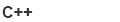

## Configuration

Functions for device/system configuration.

### ConnectWifi

ConnectWifi(*ssid*, *password*)
 

N/A

Connect to a WiFi access point with the given `ssid` and `password`.

### NetworkTime

NetworkTime(*transport*)
 

N/A

Set the date/time using an Internet time server with the given `transport` (e.g. a `WiFiClient`)

### Sleepy

Sleepy()
 

N/A

Enable automatic sleep mode when idle.

