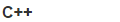
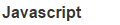

## Filtering

Operations that output a subset of their input items.

### Drop

Drop&lt;*type*&gt;(*n*)
 

Drop(*n*)

Output all input items except the first `n`

### Take

Take&lt;*type*&gt;(*n*)
 

Take(*n*)

Output only the first `n` input items.

### Dedup

Dedup&lt;*type*&gt;()
 

Dedup()

Output every input item that is not equal to the previous input item.

### Dedup (expiring)

Dedup (expiring)&lt;*type*&gt;()
 

Dedup (expiring)()

Output the input item if it is not equal to the previous input or it has been more than `milli` milliseconds since the last output.

### Debounce

Debounce&lt;*type*&gt;(*millis*)
 

Debounce(*millis*)

Outputs each input after `millis` milliseconds if no other input has been received.

### Sample

Sample&lt;*type*&gt;(*millis*)
 

Sample(*millis*)

Generates a stream of values with the latest value from its input stream every `millis` milliseconds.

### Over

Over&lt;*type*&gt;(*threshold*)
 

Over(*threshold*)

Output only input items greater than `threshold`.

### Under

Under&lt;*type*&gt;(*threshold*)
 

Under(*threshold*)

Output only input items less than `threshold`.

### AtLeast

AtLeast&lt;*type*&gt;(*threshold*)
 

AtLeast(*threshold*)

Output only input items greater than or equal to `threshold`.

### AtMost

AtMost&lt;*type*&gt;(*threshold*)
 

AtMost(*threshold*)

Output only input items less than or equal to `threshold`.

### Positive

Positive&lt;*type*&gt;()
 

Positive()

Output only input items that are greater than 0.

### Negative

Negative&lt;*type*&gt;()
 

Negative()

Output only input items that are less than 0.

### Zero

Zero&lt;*type*&gt;()
 

Zero()

Output only input items that are less than 0.

### True

True&lt;*type*&gt;()
 

True()

Output only input items equal to true.

### False

False&lt;*type*&gt;()
 

False()

Output only input items equal to false.

### Filter

Filter&lt;*type*&gt;(*function*)
 

Filter(*function*)

For each input item, apply the given function and output the input if the function returns true.

## Transformation

Operations that transforms each input item to produce an output item.

### Const

Const&lt;*type*&gt;(*value*)
 

Const(*value*)

For each input item, output `value`.

### Scale

Scale&lt;*type*&gt;(*k*)
 

Scale(*k*)

For each input item, output `k` __×__ input value.

### Add

Add&lt;*type*&gt;(*b*)
 

Add(*b*)

For each input item, output `b` __+__ input value.

### Clamp

Clamp&lt;*type*&gt;(*lo*, *hi*)
 

Clamp(*lo*, *hi*)

For each input item, output `lo` if the input is less than `lo`, `hi` if the input more than `hi`, or the input value if it is between `lo` and `hi`.

### ClampLow

ClampLow&lt;*type*&gt;(*lo*)
 

ClampLow(*lo*)

For each input item, output the maximum of the input value or `lo`.

### ClampHigh

ClampHigh&lt;*type*&gt;(*hi*)
 

ClampHigh(*hi*)

For each input item, output the minimum of the input value or `hi`.

### IsOver

IsOver&lt;*type*&gt;(*threshold*)
 

IsOver(*threshold*)

Output true for each input item greater than `threshold` otherwise false.

### IsUnder

IsUnder&lt;*type*&gt;(*threshold*)
 

IsUnder(*threshold*)

Output true for each input item less than `threshold` otherwise false.

### IsAtLeast

IsAtLeast&lt;*type*&gt;(*threshold*)
 

IsAtLeast(*threshold*)

Output true for each input item greater than or equal to `threshold` otherwise false.

### IsAtMost

IsAtMost&lt;*type*&gt;(*threshold*)
 

IsAtMost(*threshold*)

Output true for each input item less than or equal to `threshold` otherwise false.

### IsPositive

IsPositive&lt;*type*&gt;()
 

IsPositive()

Output true for each input item that is greater than 0 otherwise false.

### IsNegative

IsNegative&lt;*type*&gt;()
 

IsNegative()

Output true for each input item that is less than 0 otherwise false.

### IsZero

IsZero&lt;*type*&gt;()
 

IsZero()

Output true for each input item that is less than 0 otherwise false.

### Toggle

Toggle&lt;*in-type*,*out-type*&gt;(*initial*)
 

Toggle(*initial*)

On the first input, output __!__ `initial` and thereafter output __!__ previous output.

### Project1

Project1&lt;*type*&gt;()
 

Project1()

For each tuple input item, output the 1st element of the tuple

### Project2

Project2&lt;*type*&gt;()
 

Project2()

For each tuple input item, output the 2nd element of the tuple

### Project3

Project3&lt;*type*&gt;()
 

Project3()

For each tuple input item, output the 3rd element of the tuple

### Counted

Counted&lt;*in-type*,*counter-type*&gt;()
 

Counted()

For each tuple input item, output a tuple with the input item and total number of inputs seen.

### Map

Map&lt;*in-type*,*out-type*&gt;(*function*)
 

Map(*function*)

For each tuple input item, apply the given `function` to the input and output the returned value.

### Scan

Scan&lt;*in-type*,*state-type*&gt;(*function*, *init*)
 

Scan(*function*, *init*)

The scan operator keeps a state of `state-type` which is initially `init`.  For each input item, the given `function` is called with the input item and the current state as arguments.  The returned value is output and becomes the new state.

## Aggregation

Operators that aggregate or summarize information from multiple items in output items.

### Count

Count&lt;*type*&gt;()
 

Count()

For each item received, output the total number of items received since the start.

### WinSum

WinSum&lt;*type*,*width*&gt;()
 

WinSum(*width*)

Outputs the sum of a `width` size sliding window over the input stream.

### SumOf

SumOf&lt;*type*,*count*&gt;()
 

SumOf(*count*)

Outputs the sum of each batch of `count` input items.

### SumOver

SumOver&lt;*type*&gt;(*millis*)
 

SumOver(*millis*)

Outputs the sum of each batch of input items received over `millis` milliseconds.

### WinAverage

WinAverage&lt;*type*,*width*&gt;()
 

WinAverage(*width*)

Outputs the average of a `width` size sliding window over the input stream.

### AverageOf

AverageOf&lt;*type*,*count*&gt;()
 

AverageOf(*count*)

Outputs the average of each batch of `count` input items.

### AverageOver

AverageOver&lt;*type*&gt;(*millis*)
 

AverageOver(*millis*)

Outputs the average of each batch of input items received over `millis` milliseconds.

### WinMin

WinMin&lt;*type*,*width*&gt;()
 

WinMin(*width*)

Outputs the minimum of a `width` size sliding window over the input stream.

### MinOf

MinOf&lt;*type*,*count*&gt;()
 

MinOf(*count*)

Outputs the minimum of each batch of `count` input items.

### MinOver

MinOver&lt;*type*&gt;(*millis*)
 

MinOver(*millis*)

Outputs the minimum of each batch of input items received over `millis` milliseconds.

### WinMax

WinMax&lt;*type*,*width*&gt;()
 

WinMax(*width*)

Outputs the maximum of a `width` size sliding window over the input stream.

### MaxOf

MaxOf&lt;*type*,*count*&gt;()
 

MaxOf(*count*)

Outputs the maximum of each batch of `count` input items.

### MaxOver

MaxOver&lt;*type*&gt;(*millis*)
 

MaxOver(*millis*)

Outputs the maximum of each batch of input items received over `millis` milliseconds.

## Miscellaneous

### Range

Range&lt;*type*&gt;(*from*, *to*, *increment*)
 

Range(*from*, *to*, *increment*)

Generates integers in the range `from` to `to` by `increment`.  The increment is optional and defaults to 1.  Combine with `Iterate` to generate a stream.

### Iterate

Iterate&lt;*type*&gt;(*millis*, *repeat*)
 

Iterate(*millis*, *repeat*)

Generates a stream of values from a generator (e.g. `Range`).  The values are generated one every `millis` milliseconds.  If `repeat` is true then the iterater will start over with the 1st value after it reaches the last.  The millis and repeat parameters are optional with defaults 0 and false respectively.

### Poll

Poll&lt;*type*&gt;(*millis*)
 

Poll(*millis*)

Generates a stream of values from an input by polling the current value every `millis` milliseconds.

### Format

Format&lt;*type*&gt;(*format*)
 

Format(*format*)

Build a formatted string from input items using the `format` template.  Any occurrence of `$1` in the template is replaced by the input value.  Occurrences of `$t` are replaced by the current time as a Unix timestamp (number of seconds since Jan. 1, 1970).

