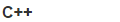

## Aggregation

Operators that aggregate or summarize information from multiple items in output items.

#### Count

Count&lt;class&gt;()
 

Count()

For each item received, output the total number of items received since the start.

#### WinSum

WinSum&lt;class,width&gt;()
 

WinSum(width)

Outputs the sum of a `width` size sliding window over the input stream.

